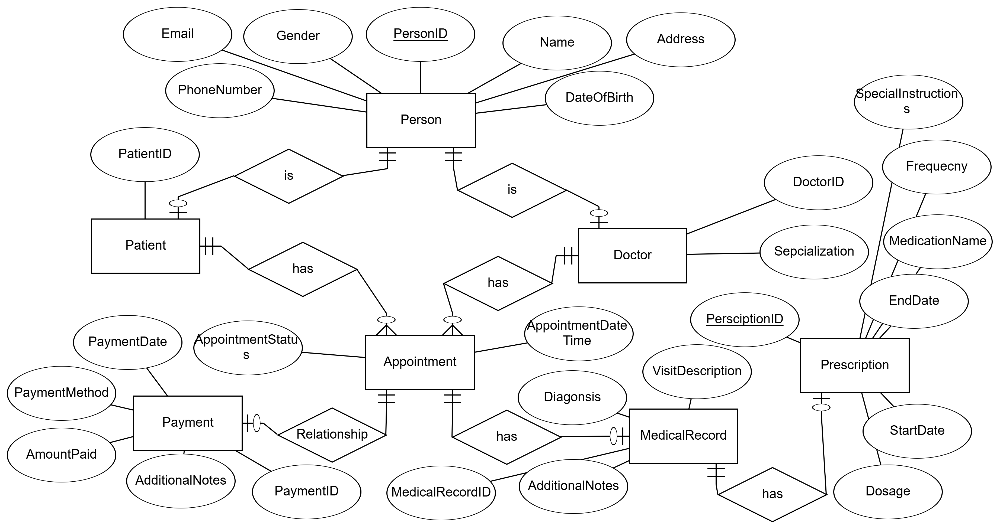

# 📊 Simple Clinic Management System - Database Design

## Table of Contents

1. [Project Overview](#1-project-overview)  
2. [Requirements](#2-requirements)  
3. [Converting Text Requirements to Database Design](#3-converting-text-requirements-to-database-design)  
   - [Step 1: Analyzing the Requirements](#step-1-analyzing-the-requirements)  
   - [Step 2: Identifying Relationships](#step-2-identifying-relationships)  
   - [Step 3: Designing the Relational Schema](#step-3-designing-the-relational-schema)  
   - [Step 4: Writing SQL Code](#step-4-writing-sql-code)  

---


## 1. Project Overview

This document presents the database design for a **Simple Clinic Management System**. The purpose is to create a structured, scalable, and normalized database that can handle patient, doctor, appointment, medical record, prescription, and payment information efficiently.

### Objectives

- Efficiently store and manage patient and doctor data.
- Handle appointment scheduling and tracking.
- Maintain medical records linked to attended appointments.
- Manage prescription details for patients.
- Record payment transactions associated with appointments.

---
## 2. Requirements
Create Relational Schema for the following project:
Here are the database requirements for a simple clinic:

```
1. Patients:
• The database should store information about patients.
• Each patient should have a unique identifier, a name, a date of birth, gender, contact information (phone number, email), and address.

2. Doctors:
• The database should store information about doctors.
• Each doctor should have a unique identifier, a name, specialization, a date of birth, gender, contact information (phone number, email), and address.

3. Appointments:
• The database should store information about appointments.
• Each appointment should have a unique identifier, a patient, a doctor, appointment date and time, and appointment status.
• Appointment Status:
  1. Pending
  2. Confirmed
  3. Completed
  4. Canceled
  5. Rescheduled
  6. No Show

4. Medical Records:
• The database should store medical records for patients.
• Each medical record should have a unique identifier, a patient, a doctor, a description of the visit, diagnosis, prescribed medication, and any additional notes.

5. Prescription:
• The database should store information about prescribed medications.
• Each prescription should have a unique identifier, a medical record, medication name, dosage, frequency, start date, end date, and any special instructions.

6. Payments:
• The database should store information about payments.
• Each payment should have a unique identifier, a patient, a payment date, payment method, amount paid, and any additional notes.
```

## 3. Converting Text Requirements to Database Design

### Step 1: Analyzing the Requirements

Start by identifying key entities and relationships from the text:

- **Patients:** PatientID (PK), Name, DateOfBirth, Gender, PhoneNumber, Email, Address
- **Doctors:** DoctorID (PK), Name, Specialization, DateOfBirth, Gender, PhoneNumber, Email, Address
- **Appointments:** AppointmentID (PK), PatientID (FK), DoctorID (FK), AppointmentDateTime, AppointmentStatus, MedicalRecordID (FK), PaymentID (FK)
- **Medical Records:** MedicalRecordID (PK), VisitDescription, Diagnosis, AdditionalNotes
- **Prescriptions:** PrescriptionID (PK), MedicalRecordID (FK), MedicationName, Dosage, Frequency, StartDate, EndDate, SpecialInstructions
- **Payments:** PaymentID (PK), PaymentDate, PaymentMethod, AmountPaid, AdditionalNotes

---

### Step 2: Identifying Relationships

- A **Patient** can have multiple **Appointments**.  
- A **Doctor** can attend multiple **Appointments**.  
- An **Appointment** can have a **Medical Record**.  

---
### Step 3: Designing ERD


#### The final Result :


### Step 4: Designing the Relational Schema
[Watch the video](./simpleclincerd.mp4)


---

### Step 5: Writing SQL Code

The SQL script to create the tables and relationships:

```sql
-- Step 1: Create all tables without foreign keys

CREATE TABLE Persons (
    PersonID INT PRIMARY KEY IDENTITY(1,1),
    Name NVARCHAR(100) NOT NULL,
    DateOfBirth DATE NOT NULL,
    Gender NVARCHAR(1) NOT NULL,
    PhoneNumber NVARCHAR(20) UNIQUE,
    Email NVARCHAR(100) UNIQUE,
    Address NVARCHAR(200)
);

CREATE TABLE Patients (
    PatientID INT PRIMARY KEY IDENTITY(1,1),
    PersonID INT
);

CREATE TABLE Doctors (
    DoctorID INT PRIMARY KEY IDENTITY(1,1),
    PersonID INT,
    Specialization NVARCHAR(100)
);

CREATE TABLE MedicalRecords (
    MedicalRecordID INT PRIMARY KEY IDENTITY(1,1),
    VisitDescription NVARCHAR(200),
    Diagnosis NVARCHAR(200),
    AdditionalNotes NVARCHAR(200)
);

CREATE TABLE Payments (
    PaymentID INT PRIMARY KEY IDENTITY(1,1),
    PaymentDate DATE NOT NULL,
    PaymentMethod NVARCHAR(50),
    AmountPaid DECIMAL(10, 2),
    AdditionalNotes NVARCHAR(200)
);

CREATE TABLE Appointments (
    AppointmentID INT PRIMARY KEY IDENTITY(1,1),
    PatientID INT,
    DoctorID INT,
    AppointmentDateTime DATETIME NOT NULL,
    AppointmentStatus TINYINT NOT NULL,
    MedicalRecordID INT,
    PaymentID INT
);

CREATE TABLE Prescriptions (
    PrescriptionID INT PRIMARY KEY IDENTITY(1,1),
    MedicalRecordID INT,
    MedicationName NVARCHAR(100),
    Dosage NVARCHAR(50),
    Frequency NVARCHAR(50),
    StartDate DATE,
    EndDate DATE,
    SpecialInstructions NVARCHAR(200)
);

-- Step 2: Add foreign key constraints after all tables are created

ALTER TABLE Patients
ADD CONSTRAINT FK_Person_Patient FOREIGN KEY (PersonID) REFERENCES Persons(PersonID);

ALTER TABLE Doctors
ADD CONSTRAINT FK_Person_Doctor FOREIGN KEY (PersonID) REFERENCES Persons(PersonID);

ALTER TABLE Appointments
ADD CONSTRAINT FK_Appointment_Patient FOREIGN KEY (PatientID) REFERENCES Patients(PatientID);

ALTER TABLE Appointments
ADD CONSTRAINT FK_Appointment_Doctor FOREIGN KEY (DoctorID) REFERENCES Doctors(DoctorID);

ALTER TABLE Appointments
ADD CONSTRAINT FK_Appointment_MedicalRecord FOREIGN KEY (MedicalRecordID) REFERENCES MedicalRecords(MedicalRecordID);

ALTER TABLE Appointments
ADD CONSTRAINT FK_Appointment_Payment FOREIGN KEY (PaymentID) REFERENCES Payments(PaymentID);

ALTER TABLE Prescriptions
ADD CONSTRAINT FK_Prescription_MedicalRecord FOREIGN KEY (MedicalRecordID) REFERENCES MedicalRecords(MedicalRecordID);

```

