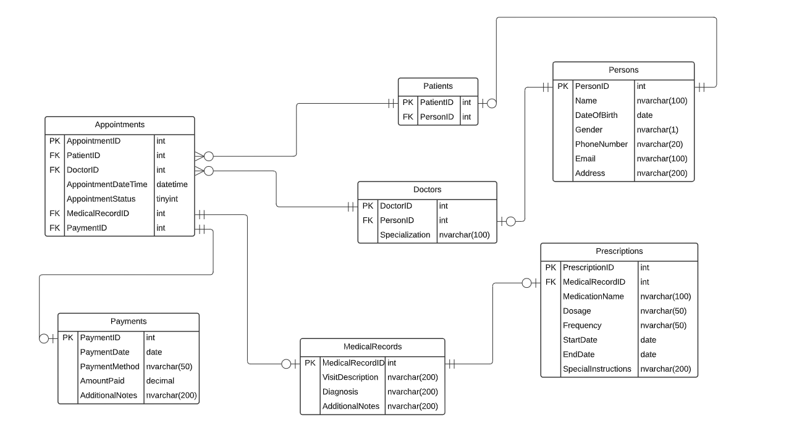

# 📊 Simple Clinic Management System - Database Design

## Table of Contents

1. [Project Overview](#1-project-overview)  
2. [Converting Text Requirements to Database Design](#2-converting-text-requirements-to-database-design)  
   - [Step 1: Analyzing the Requirements](#step-1-analyzing-the-requirements)  
   - [Step 2: Identifying Relationships](#step-2-identifying-relationships)  
   - [Step 3: Designing the Relational Schema](#step-3-designing-the-relational-schema)  
   - [Step 4: Writing SQL Code](#step-4-writing-sql-code)  

---

## 1. Project Overview


This document presents the database design for a **Simple Clinic Management System**. The purpose is to create a structured, scalable, and normalized database that can handle patient, doctor, appointment, medical record, prescription, and payment information efficiently.

### Objectives

- Efficiently store and manage patient and doctor data.
- Handle appointment scheduling and tracking.
- Maintain medical records linked to attended appointments.
- Manage prescription details for patients.
- Record payment transactions associated with appointments.

---
## 2. Requreiments :
Create Relational Schema for the following project:
Here are the database requirements for a simple clinic:
```text
1. Patients:
• The database should store information about patients.
• Each patient should have a unique identifier, a name, a
date of birth, gender, contact information (phone number,
email), and address.

2. Doctors:
• The database should store information about doctors.
• Each doctor should have a unique identifier, a name,
specialization, a date of birth, gender, contact
information (phone number, email), and address.

3. Appointments:
• The database should store information about appointments.
• Each appointment should have a unique identifier, a
patient, a doctor, appointment date and time, and
appointment status.
• Appointment Status:
1. Pending: The appointment has been scheduled but has not
yet occurred.
2. Confirmed: The appointment has been confirmed by both
the patient and the healthcare provider.
3. Completed: The appointment has taken place as scheduled.
4. Canceled: The appointment has been canceled either by
the patient or the healthcare provider.
5. Rescheduled: The appointment has been rescheduled for a
different date or time.
6. No Show: The patient did not show up for the appointment
without canceling or rescheduling.

4. Medical Records:
• The database should store medical records for patients.
• For each attended appointment there should be a medical
record.
• Each medical record should have a unique identifier, a
patient, a doctor, a description of the visit, diagnosis,
prescribed medication, and any additional notes.

5. Prescription:
• The database should store information about prescribed
medications.
• For each medical record there should be at most one
prescription.
• Each prescription should have a unique identifier, a
medical record, medication name, dosage, frequency, start
date, end date, and any special instructions.

6. Payments:
• The database should store information about payments.
• Payment is per appointment.
• Each payment should have a unique identifier, a patient, a
payment date, payment method, amount paid, and any additional
notes
```
## 2. Converting Text Requirements to Database Design

The process of converting textual project requirements into a structured database design involves the following steps:

### Step 1: Analyzing the Requirements

Start by carefully reading and breaking down the given text to identify key entities and relationships. Here’s the detailed analysis of each entity and relationship:

#### Patients:
- **Entity Identified:** Patient  
- **Attributes:** patient_id (PK), name, date_of_birth, gender, phone_number, email, address  

#### Doctors:
- **Entity Identified:** Doctor  
- **Attributes:** doctor_id (PK), name, specialization, date_of_birth, gender, phone_number, email, address  

#### Appointments:
- **Entity Identified:** Appointment  
- **Attributes:** appointment_id (PK), patient_id (FK), doctor_id (FK), appointment_date_time, appointment_status, medical_record_id (FK), payment_id (FK)  

#### Medical Records:
- **Entity Identified:** Medical Record  
- **Attributes:** medical_record_id (PK), visit_description, diagnosis, additional_notes  

#### Prescriptions:
- **Entity Identified:** Prescription  
- **Attributes:** prescription_id (PK), medical_record_id (FK), medication_name, dosage, frequency, start_date, end_date, special_instructions  

#### Payments:
- **Entity Identified:** Payment  
- **Attributes:** payment_id (PK), payment_date, payment_method, amount_paid, additional_notes  

#### Persons:
- **Entity Identified:** Person  
- **Attributes:** person_id (PK), name, date_of_birth, gender, phone_number, email, address  

---

### Step 2: Identifying Relationships

Next, identify how these entities relate to one another. For example:

- A **Patient** can have multiple **Appointments**.  
- A **Doctor** can attend multiple **Appointments**.  
- An **Appointment** can have a **Medical Record**.  

---

### Step 3: Designing the Relational Schema

After identifying entities and relationships, we draft the **Relational Schema** to represent the tables, primary keys, and foreign key relationships clearly.


---

### Step 4: Writing SQL Code

The final step is implementing the database structure using SQL Server. The following script contains the complete SQL code for creating all tables and establishing relationships:

```sql
CREATE TABLE Persons (
    PersonID INT PRIMARY KEY IDENTITY(1,1),
    Name NVARCHAR(100) NOT NULL,
    DateOfBirth DATE NOT NULL,
    Gender NVARCHAR(1) NOT NULL,
    PhoneNumber NVARCHAR(20) UNIQUE,
    Email NVARCHAR(100) UNIQUE,
    Address NVARCHAR(200)
);

CREATE TABLE Patients (
    PatientID INT PRIMARY KEY IDENTITY(1,1),
    PersonID INT FOREIGN KEY REFERENCES Persons(PersonID)
);

CREATE TABLE Doctors (
    DoctorID INT PRIMARY KEY IDENTITY(1,1),
    PersonID INT FOREIGN KEY REFERENCES Persons(PersonID),
    Specialization NVARCHAR(100)
);

CREATE TABLE Appointments (
    AppointmentID INT PRIMARY KEY IDENTITY(1,1),
    PatientID INT FOREIGN KEY REFERENCES Patients(PatientID),
    DoctorID INT FOREIGN KEY REFERENCES Doctors(DoctorID),
    AppointmentDateTime DATETIME NOT NULL,
    AppointmentStatus TINYINT NOT NULL,
    MedicalRecordID INT FOREIGN KEY REFERENCES MedicalRecords(MedicalRecordID),
    PaymentID INT FOREIGN KEY REFERENCES Payments(PaymentID)
);

CREATE TABLE MedicalRecords (
    MedicalRecordID INT PRIMARY KEY IDENTITY(1,1),
    VisitDescription NVARCHAR(200),
    Diagnosis NVARCHAR(200),
    AdditionalNotes NVARCHAR(200)
);

CREATE TABLE Prescriptions (
    PrescriptionID INT PRIMARY KEY IDENTITY(1,1),
    MedicalRecordID INT FOREIGN KEY REFERENCES MedicalRecords(MedicalRecordID),
    MedicationName NVARCHAR(100),
    Dosage NVARCHAR(50),
    Frequency NVARCHAR(50),
    StartDate DATE,
    EndDate DATE,
    SpecialInstructions NVARCHAR(200)
);

CREATE TABLE Payments (
    PaymentID INT PRIMARY KEY IDENTITY(1,1),
    PaymentDate DATE NOT NULL,
    PaymentMethod NVARCHAR(50),
    AmountPaid DECIMAL(10, 2),
    AdditionalNotes NVARCHAR(200)
);
```
