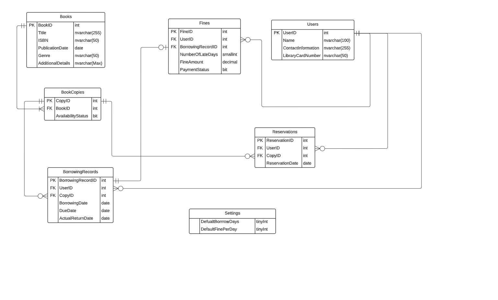

# 📚 Simple Library Management System - Database Design

## Table of Contents

1. [Project Overview](#1-project-overview)  
2. [Requirements](#2-requirements)  
3. [Converting Text Requirements to Database Design](#3-converting-text-requirements-to-database-design)  
   - [Step 1: Analyzing the Requirements](#step-1-analyzing-the-requirements)  
   - [Step 2: Identifying Relationships](#step-2-identifying-relationships)  
   - [Step 3: Designing the Relational Schema](#step-3-designing-the-relational-schema)  
   - [Step 4: Writing SQL Code](#step-4-writing-sql-code)  

---


## 1. Project Overview

This document presents the database design for a **Simple Library Management System**. The purpose is to create a structured, scalable, and normalized database that can handle book management, user management, borrowing, returns, reservations, and fine management efficiently.

### Objectives

- Efficiently store and manage book data.
- Track book availability and manage multiple copies.
- Maintain user records and library card information.
- Handle borrowing, returns, and associated fine management.
- Manage reservations and hold requests fairly.

---
## 2. Requirements
Create Relational Schema for the following project:
Here are the database requirements for a simple library management system:

```
1. Book Management:
• Store and manage information about books, including title, author(s), ISBN, publication date, genre, and additional details.
• Track availability status of book copies, indicating whether they are available for borrowing or checked out by users.
• Manage multiple copies of a book, each with a unique identifier (copy ID).

2. User Management:
• Maintain records of library users, including their names, contact information, and library card numbers.

3. Borrowing and Returns:
• Enable users to borrow book copies from the library.
• Track borrowing records, including the book copy borrowed, user information, borrowing date, and due date.
• Handle the return process, updating the availability status of book copies.
• Check for any fines or penalties associated with late returns or damaged book copies.

4. Holds and Reservations:
• Allow users to place holds or reservations on book copies that are currently checked out.
• Manage the order of reservations to ensure fairness.

5. Fine Management:
• Calculate and manage fines or penalties for late returns of book copies.
• Keep track of the fine amount owed by each user.
• Maintain the payment status to track whether fines have been paid or are still pending.
```

## 3. Converting Text Requirements to Database Design

### Step 1: Analyzing the Requirements

Start by identifying key entities and relationships from the text:

- **Books:** BookID (PK), Title, ISBN, PublicationDate, Genre, AdditionalDetails
- **BookCopies:** CopyID (PK), BookID (FK), AvailabilityStatus
- **Users:** UserID (PK), Name, ContactInformation, LibraryCardNumber
- **BorrowingRecords:** BorrowingRecordID (PK), UserID (FK), CopyID (FK), BorrowingDate, DueDate, ActualReturnDate
- **Reservations:** ReservationID (PK), UserID (FK), CopyID (FK), ReservationDate
- **Fines:** FineID (PK), UserID (FK), BorrowingRecordID (FK), NumberOfLateDays, FineAmount, PaymentStatus
- **Settings:** DefaultBorrowDays, DefaultFinePerDay

---

### Step 2: Identifying Relationships

- A **User** can borrow multiple **BookCopies**.  
- A **Book** can have multiple **Copies**.  
- A **BorrowingRecord** can be linked to **Fines**.  
- A **User** can place multiple **Reservations**.  

---
### Step 3: Designing ERD


#### The final Result :


### Step 4: Designing the Relational Schema

```
-- Step 1: Create all tables without foreign keys

CREATE TABLE Books (
    BookID INT PRIMARY KEY IDENTITY(1,1),
    Title NVARCHAR(255),
    ISBN NVARCHAR(50),
    PublicationDate DATE,
    Genre NVARCHAR(50),
    AdditionalDetails NVARCHAR(MAX)
);

CREATE TABLE BookCopies (
    CopyID INT PRIMARY KEY IDENTITY(1,1),
    BookID INT,
    AvailabilityStatus BIT
);

CREATE TABLE Users (
    UserID INT PRIMARY KEY IDENTITY(1,1),
    Name NVARCHAR(100),
    ContactInformation NVARCHAR(255),
    LibraryCardNumber NVARCHAR(50)
);

CREATE TABLE BorrowingRecords (
    BorrowingRecordID INT PRIMARY KEY IDENTITY(1,1),
    UserID INT,
    CopyID INT,
    BorrowingDate DATE,
    DueDate DATE,
    ActualReturnDate DATE
);

CREATE TABLE Reservations (
    ReservationID INT PRIMARY KEY IDENTITY(1,1),
    UserID INT,
    CopyID INT,
    ReservationDate DATE
);

CREATE TABLE Fines (
    FineID INT PRIMARY KEY IDENTITY(1,1),
    UserID INT,
    BorrowingRecordID INT,
    NumberOfLateDays SMALLINT,
    FineAmount DECIMAL(10, 2),
    PaymentStatus BIT
);

CREATE TABLE Settings (
    DefaultBorrowDays TINYINT,
    DefaultFinePerDay TINYINT
);
```

